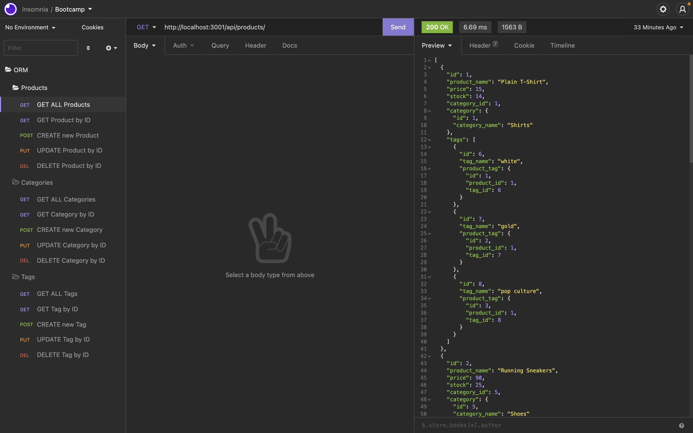
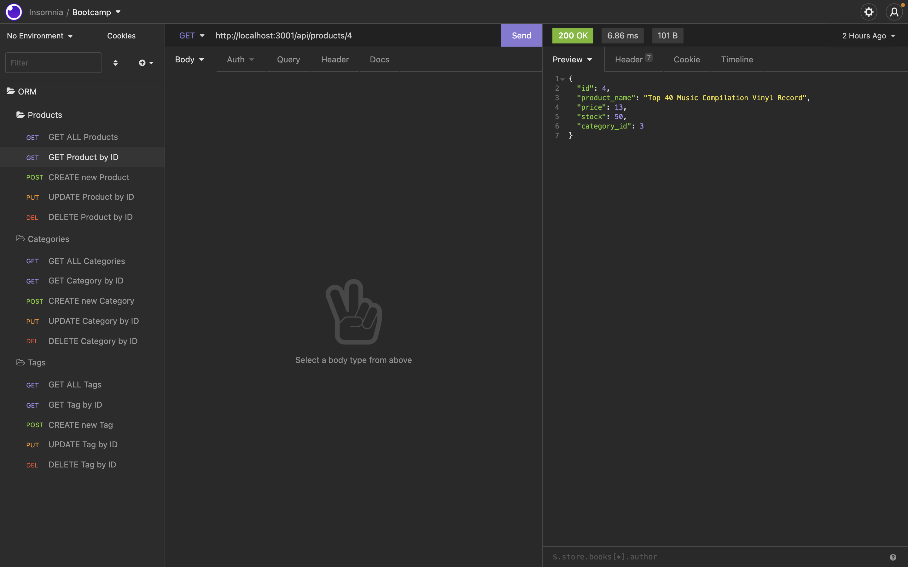

---
  
# E-Commerce-Back-End

  

Table of Contents

  
<ol>
  
<li>
  
<a href="#about-the-project">About The Project</a></li>

  
<ul>
  
<li><a href="#built-with">Built With</a></li>

<li><a href="#usage">Usage</a></>
</ul>

</li>

<li>

<a href="#getting-started">Getting Started</a>

<ul>

<li><a href="#installation">Installation</a>

</ul>

</li>
<li><a href="#license">License</a></>
  
<li><a href="#contact">Contact</a></>
  
</ol>
  

 ## About The Project

 

This is a back end for an e-commerce site by modifying starter code. This uses Express.js API to use Sequelize to interact with a MySQL database.

(<a href="#top">back to top</a>)</>

 ## Built With
* [Node.js](https://nodejs.org/) 
* [MySQL2](https://www.npmjs.com/package/mysql2) 
* [Sequelize](https://www.npmjs.com/package/sequelize) 
* [dotenv](https://www.npmjs.com/package/dotenv) 

 (<a href="#top">back to top</a>)</>

## Usage

  Following video shows this application's functionality. Click the image to watch the video

[Click here to watch the walk through video](https://youtu.be/GM5H4jREpCI)

(<a href="#top">back to top</a>)</>

## Getting Started

To get a local copy up and running follow these simple example steps.

 ## Installation

 1: The application will be invoked by using the following command:

 `Clone: git clone git@github.com:ayacomputer/13-E-Commerce-Back-End.git`

 2: Make sure that .env file has your DB password

 [How to set the env file.](https://drive.google.com/file/d/12BokJA0Ah2Hz0zT_xI3t1wDmCcbFK3n4/view)

 3: Install npm packages

 `npm i` 

 4: Run mysql and source db.schema.sql by using the following commands:
  `mysql -u root -p` (enter your mysql password)
  `source db/schema.sql;`

 5: Run seed files
 `npm run seed`

 6: Run to start the application
  `npm start`
  

(<a href="#top">back to top</a>)</>

## License

Distributed under MIT License.

See LICENSE.txt for more information.

(<a href="#top">back to top</a>)</>

 ## Contact Me

Ayako Woollan - ayako.woollan@gmail.com

Project Link: [https://github.com/ayacomputer/13-E-Commerce-Back-End](https://github.com/ayacomputer/13-E-Commerce-Back-End)

(<a href="#top">back to top</a>)</>
